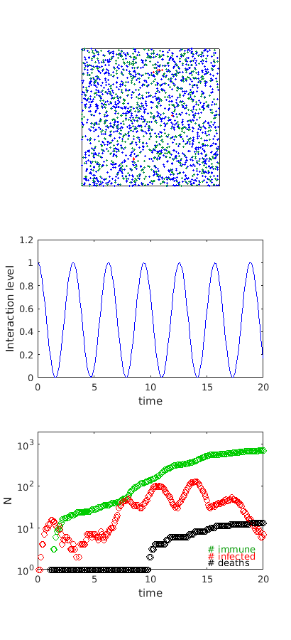

# Coronavirus Toy Simulation

Philip Mocz (2020)
Pinceton University
http://pmocz.github.io/

Free to use -- please give credit!

Simulates a population of interacting particles that can get infected/die

Explore the effects of various isolation measures! E.g. sinusoidal isolation:

